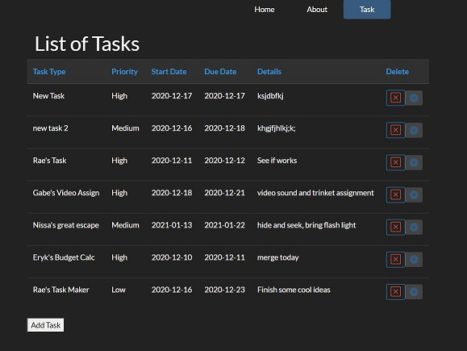
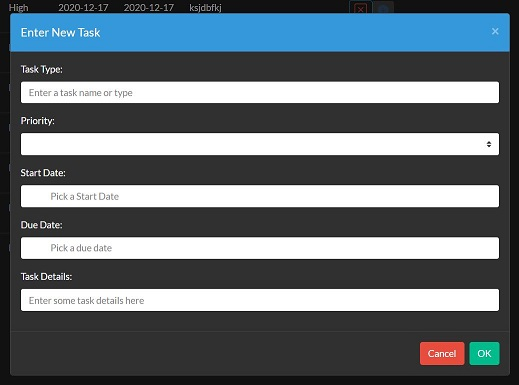
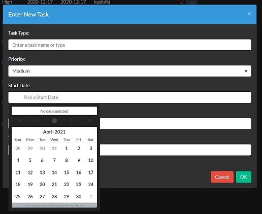

# Task/Budget Program

This is a small program I made as a class project with another classmate first semester, second year. 
It feature the use of PHP as an API and database. and Vue.js as a frontend GUI interface. 
This Demostrates the use of both these langauges and dynamic server communication.

# Areas I Contributed Too

 My protion of the project was the Task List.
 Backend (PHP) Features: 
  - Database to hold all the tasks in. 
  - A Task entity to add get and set tasks. Also has custom validation through annotations.
  - A Custom Controller: GET, PUT, POST, and DELETE Tasks. This controller are helps populate all the feilds and 
    interact with the database.
  - API interface to communicate with the frontend and controller
Frontend (Vue.js) Features:



 - Dynamic list: 
          - Sorts the list 
          - New tasks are add to the top of the list 
          - Deleted tasks are removed form the list
          - Modal for add tasks:
                - interactive calendar 
                - a scroll list for setting the priority 
        




# Things To Improve

1. Change the colour scheme to a neutral background for easier viewing
2. Work on the Update task button
3. Better Error checking


# Notes: Use on Programs
# cweb-vuejs

## Project setup - in terminal navigate to \vue-ui\
```
npm install
```

### Compiles and hot-reloads for development  - in terminal navigate to \vue-ui\
```
npm run serve
```

### Compiles and minifies for production  - in terminal navigate to \vue-ui\
```
npm run build
```

### Lints and fixes files - in terminal navigate to \vue-ui\
```
npm run lint
```

### PHP Webserver - in terminal, navigate to \php-api\wwwroot\
```
php -S localhost:8003
```

### PHP Composer Install - in terminal, navigate to \php-api\
```
php commposer.phar install
```

### Customize configuration
See [Configuration Reference](https://cli.vuejs.org/config/).
